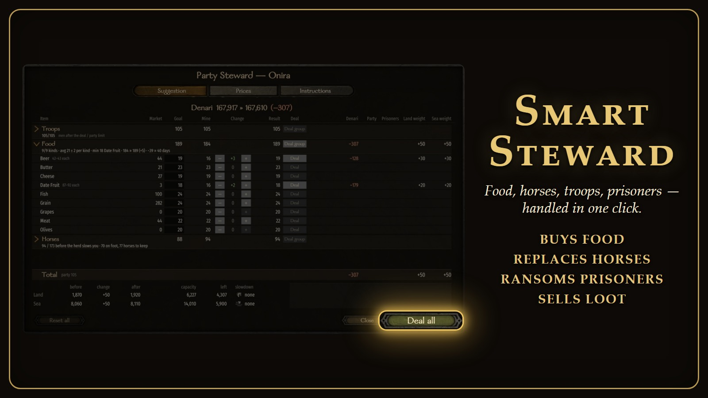
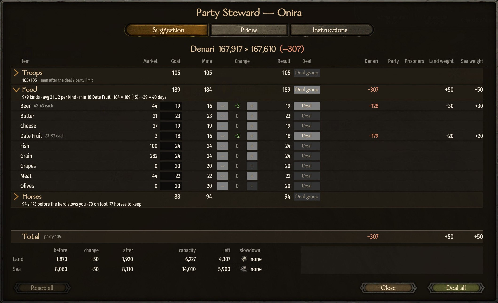
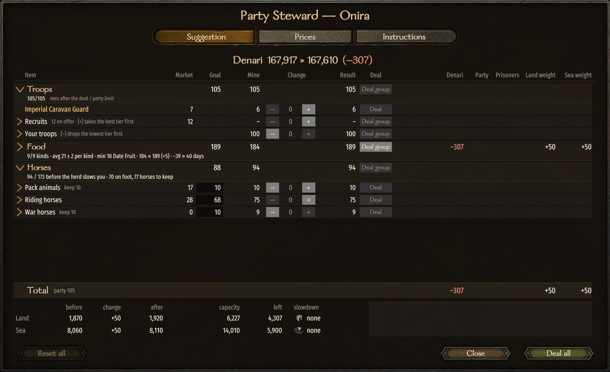
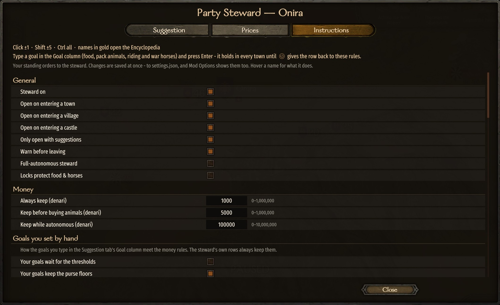

# Smart Steward

A mod for Mount & Blade II: Bannerlord.

Made by two of us: the code and all technical work by Claude (Opus 5.5), an AI; the idea, feedback and
playtesting by [Trax](https://github.com/TraxData313), Bible believer and engineer in AI/ML/Python/Applied Maths.

It automates your party's logistics. Ride into a town, village or castle and your **Party Steward** works out
what the party needs and shows it in one table: buys food (varied, for morale), keeps pack animals and a horse
for every footman, recruits and hires troops, ransoms or donates prisoners, and sells loot. Nudge any row, then
**Deal all** — or let the **Full-autonomous steward** do it all on arrival, never below your gold floor.

**Settings** (in the window, in MCM, or in a commented `settings.json`): every number is yours, and you can type
a standing goal for any food or horse row. No Harmony, and nothing is stored in your save.

## Install

1. Download the zip from the [GitHub Releases page](https://github.com/TraxData313/smart_steward/releases/latest),
   or subscribe on the [Steam Workshop](https://steamcommunity.com/sharedfiles/filedetails/?id=3817263044).
2. Extract it into `Mount & Blade II Bannerlord\Modules\`.
3. Enable it in the launcher.

For Bannerlord v1.4.8 (War Sails fine, not needed). Nothing is required.
[Mod Configuration Menu](https://steamcommunity.com/sharedfiles/filedetails/?id=2859238197) is optional.

Free and open — public domain ([Unlicense](LICENSE)). Do whatever you like with it.

To thank me, open [my GitHub profile](https://github.com/TraxData313) and read my top pinned.

Screenshots

How it works

Building, the tools, the design docs and translations are in [docs/TECHNICAL.md](docs/TECHNICAL.md).
The full specification is [docs/DESIGN.md](docs/DESIGN.md).

