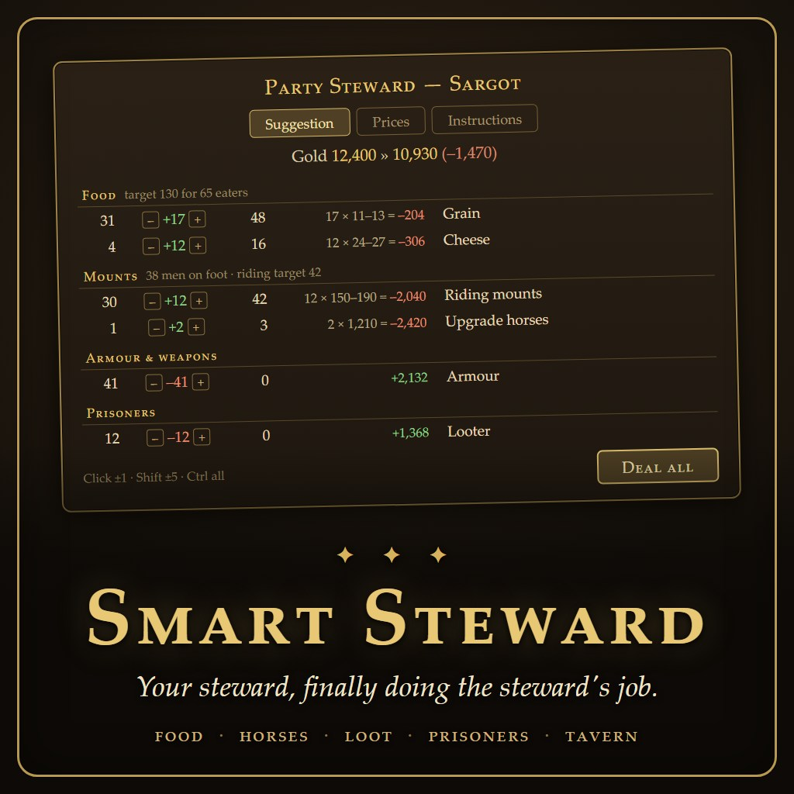

# Smart Steward



A *Mount & Blade II: Bannerlord* mod that takes the logistics chores off your hands.

Ride into a town or village and your **Party Steward** lays out, in one table, what the party needs —
nudge any row with `[–]` `[+]` (click ±1, Shift ±5, Ctrl all), then **Deal all**. Five jobs:

- **Tavern** — wanderers and the tavern's mercenaries, hired with a click (never suggested: your choice)
- **Food** — enough for everyone, varied for morale, surplus sold
- **Horses** — pack animals and a horse per footman (a set number of war horses among them); noble horses sold unless
  locked, lame ones replaced by healthy ones
- **Armour & weapons** — loot sold in bulk groups (off until you turn it on)
- **Prisoners** — ransomed, or donated to your kingdom's dungeons for influence

Plus an optional **Full-autonomous steward** for the rich: it does it all on arrival, never below your gold
floor, and reports in the message log. Every number is a setting — in the window's Instructions tab, in MCM
(optional), or in a commented `Documents\Mount and Blade II Bannerlord\Configs\SmartSteward\settings.json`.
No Harmony; nothing is stored in the save.

Game: Bannerlord **v1.4.8** (War Sails fine, not needed). Release: **Steam Workshop** (link once published).
The player-facing page is [tools/STEAM-DESCRIPTION.bbcode](tools/STEAM-DESCRIPTION.bbcode).

## Building

- **.NET 8 SDK** (builds the net472 module and the netstandard2.0 core — no Visual Studio needed).
- Bannerlord and [MCM v5](https://steamcommunity.com/sharedfiles/filedetails/?id=2859238197) installed:
  their DLLs are referenced from the install, never copied. If yours live elsewhere than the Steam defaults
  in `Directory.Build.props`, create a git-ignored `Directory.Build.props.user` beside it:
  ```xml
  <Project><PropertyGroup>
    <GameFolder>D:\Games\Mount &amp; Blade II Bannerlord</GameFolder>
    <McmBinFolder>D:\Games\...\2859238197\bin\Win64_Shipping_Client</McmBinFolder>
  </PropertyGroup></Project>
  ```

```powershell
dotnet build -c Release          # warning-free
dotnet test                      # the Core's unit tests
powershell -ExecutionPolicy Bypass -File tools\deploy.ps1         # install as "Smart Steward (dev)" (quit the game first)
powershell -ExecutionPolicy Bypass -File tools\check-soft-deps.ps1  # still loads without MCM?
powershell -ExecutionPolicy Bypass -File tools\check-gui.ps1        # the window's prefab vs this game
powershell -ExecutionPolicy Bypass -File tools\package.ps1          # all of it + dist\SmartSteward and a zip
```

Uploading is [tools/WORKSHOP-UPLOAD.md](tools/WORKSHOP-UPLOAD.md) (the game's own Workshop uploader).

## The docs

| File | What it holds |
|---|---|
| [docs/DESIGN.md](docs/DESIGN.md) | the spec — every feature, every setting with its default, the algorithms |
| [docs/RESEARCH.md](docs/RESEARCH.md) | verified game-API facts from the decompiled v1.4.8 code, and the gotchas |
| [docs/PLAYTEST.md](docs/PLAYTEST.md) | the in-game checklists, step by step |
| [TASKS_TODO.md](TASKS_TODO.md) / [TASKS_DONE.md](TASKS_DONE.md) | the board / the real changelog |
| [CLAUDE.md](CLAUDE.md) | how the work is done here, and the repository layout |
| [concept.txt](concept.txt) | the original idea, in the author's words |

## Translations

Welcome. Every player-facing text is in
[module/ModuleData/Languages/std_SmartSteward.xml](module/ModuleData/Languages/std_SmartSteward.xml) (English,
the game's own strings format). Copy it into `Languages\XX\`, translate the texts, add a `language_data.xml` —
the file's header says exactly how. The English there is generated from the code, so edit a translation's
copy, never the source.

## License

Public domain ([Unlicense](LICENSE)).
